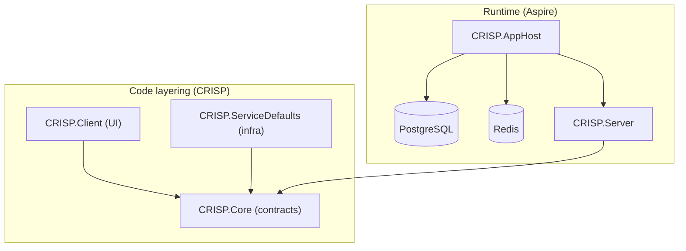
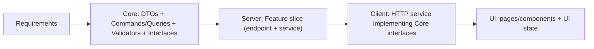

## CRISP

CRISP is a .NET 9 solution built around **.NET Aspire** for local orchestration and an **ASP.NET Core + Blazor** web app backed by **PostgreSQL** (and Redis via Aspire).

In this repo, “CRISP” also refers to the **Command Response Interface Service Pattern**: a feature-oriented architecture that combines CQRS-style commands/queries with explicit service contracts (interfaces) that are easy to discover and implement across layers.

## Solution layout

- **src/CRISP.AppHost**: .NET Aspire AppHost that starts infrastructure (PostgreSQL + Redis) and the web server.
- **src/CRISP.Server**: ASP.NET Core host for the Blazor app (interactive server + WebAssembly), Identity, EF Core, feature endpoints.
- **src/CRISP.Client**: Blazor WebAssembly client project (UI + shared client logic).
- **src/CRISP.Core**: shared domain/core layer (models, commands/queries/events, identity abstractions, etc.).
- **src/CRISP.ServiceDefaults**: shared Aspire defaults (health checks, service discovery, resilience, OpenTelemetry).

## Architecture (CRISP patterns)

- **Core is the contract**: commands, queries, DTOs, validators, and service interfaces live in `CRISP.Core`.
- **Dependency direction**: other layers depend on Core; Core should not depend on infrastructure/UI.
- **No duplication**: client/server reuse Core DTOs and commands/queries instead of redefining request/response types.
- **Validation lives in Core**: FluentValidation validators are registered from the Core assembly.
- **Vertical slices**: server features are organized by capability; endpoints should be thin and delegate to services that implement Core interfaces.

High-level view of this solution:



Request pipeline notes:

- All `/api/*` endpoints are grouped and automatically validated via `CRISP.ServiceDefaults.Middlwares.ValidationEndpointFilter`.
- Errors are handled consistently by `CRISP.ServiceDefaults.Middlwares.ExceptionHandler`.
- Request logging is enabled via `CRISP.ServiceDefaults.Middlwares.LoggingMiddleware`.

Practical workflow for adding a feature:

1. Define the Core contracts (DTOs, command/query, validator, interface)
2. Implement the server service + endpoint as a vertical slice
3. Implement the client service (HTTP) using the Core contracts
4. Add UI state/components (without duplicating domain DTOs)



## Prerequisites

- **.NET SDK**: `9.0.100` (pinned by `global.json`)
- **Docker Desktop**: required for Aspire-managed PostgreSQL/Redis containers
- Optional: **Visual Studio 2022** (the solution targets VS 17.x)

## Run (recommended)

Run the system via Aspire (starts the web app + dependencies):

```powershell
# From the repo root

dotnet restore

dotnet run --project src/CRISP.AppHost
```

The console output will include the URLs for the app and the Aspire dashboard.

## Run the web server only (advanced)

`CRISP.Server` is configured to use an Aspire-provided PostgreSQL connection named `postgres`:

```csharp
builder.AddNpgsqlDbContext<ApplicationDbContext>("postgres");
```

If you start `CRISP.Server` without the AppHost, provide the connection string yourself (for example):

```powershell
$env:ConnectionStrings__postgres = "Host=localhost;Port=5432;Database=crisp;Username=postgres;Password=postgres"

dotnet run --project src/CRISP.Server
```

## EF Core migrations

Migrations live under `src/CRISP.Server/Data/Migrations`.

Common commands:

```powershell
# Add a migration

dotnet ef migrations add <Name> --project src/CRISP.Server --startup-project src/CRISP.Server

# Apply migrations

dotnet ef database update --project src/CRISP.Server --startup-project src/CRISP.Server
```

When running server-only, make sure `ConnectionStrings__postgres` is set so EF can connect.

## Notes

- Package versions are centrally managed in `Directory.Packages.props`.
- UI uses MudBlazor.
- Observability is wired via OpenTelemetry in `CRISP.ServiceDefaults`.
