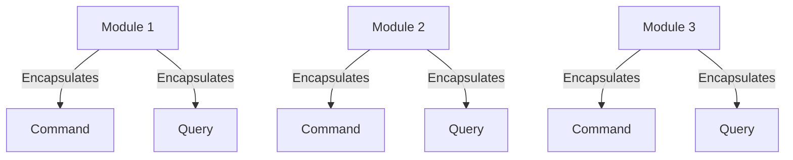

# CRISP: A Modern Approach to Scalable Applications
In software development, creating scalable, maintainable, and modular applications is a constant challenge. Enter CRISP — a design pattern that stands for **Command, Response, Interface-driven, Service-oriented, Pattern**. This is a concept we’ve coined and are actively developing to address the complexities of modern application architecture. By combining established principles like CQRS and REPR with a modular, service-oriented approach, CRISP provides a robust framework for building scalable and maintainable software.

This blog post introduces the CRISP design pattern, explains its core principles, and demonstrates how it can be applied to real-world projects. We’ll also explore how CRISP integrates CQRS, vertical layers, and REPR to create a cohesive and intuitive architecture.

CRISP stands for:
- **Command:** Separates write operations (commands) from read operations (queries) using CQRS (Command Query Responsibility Segregation).
- **Response:** Standardized responses for consistent application behavior.
- **Interface-driven:** Interfaces define service contracts, ensuring loose coupling and easier testing.
- **Service-oriented:** Functionality is organized into reusable, modular services.
- **Pattern:** A structured design approach promoting best practices and maintainability.

## CQRS: Command Query Responsibility Segregation
CRISP leverages CQRS to separate the responsibilities of commands (write operations) and queries (read operations). This separation ensures that each operation is optimized for its specific purpose, improving performance and scalability. By isolating these concerns, developers can implement distinct models for reading and writing data, reducing complexity and enhancing maintainability.

## REPR: Request Endpoint Response
CRISP standardizes application responses using the REPR model:
- **Request**: The incoming request to the application, structured and validated for consistency.
- **Endpoint**: The specific endpoint handling the request, ensuring modularity and separation of concerns.
- **Response**: A unified structure for all responses, ensuring consistency across the application.
By adopting REPR, CRISP ensures that all interactions with the application are predictable and user-friendly, reducing ambiguity and improving developer productivity.

## Vertical Layers: Modular and Scalable Architecture
CRISP organizes application functionality into vertical layers, each representing a distinct module or feature. This approach promotes modularity, making it easier to scale and maintain the application. Each vertical layer encapsulates its own commands, responses, interfaces, and services, ensuring that changes in one module do not impact others. This design also facilitates parallel development, as teams can work on different layers independently. CRISP organizes application functionality into **vertical layers**, each representing a distinct module or feature. This modular approach ensures that each layer is self-contained, promoting scalability, maintainability, and parallel development. Here’s a detailed breakdown of vertical layers in CRISP:

### What Are Vertical Layers?
Vertical layers are independent modules that encapsulate their own:
- **Commands**: Write operations specific to the module.
- **Queries**: Read operations specific to the module.
- **Services**: Business logic and operations.
- **Endpoints**: API endpoints or UI components.
- **Data Models**: Entities and data structures.

Each layer operates independently, ensuring that changes in one layer do not impact others. This design also facilitates parallel development, as teams can work on different layers simultaneously.



### Example: Project Management Module
In CrispBlazor, the `ProjectManagement` module is a vertical layer. Here’s how it is structured:

#### Commands
Commands handle write operations. For example:
```csharp
public class CreateProjectCommand : IRequest<Guid>
{
    public string Name { get; set; }
    public string Description { get; set; }
}
```

#### Queries
Queries handle read operations. For example:
```csharp
public class GetProjectQuery : IRequest<ProjectResponse>
{
    public int ProjectId { get; set; }
}
```

#### Endpoints
Endpoints expose the module’s functionality. For example:
```csharp
public class CreateProjectEndpoint : BaseEndpoint, ICreateEndpoint<CreateProjectCommand>
{
    public static void Map(RouteGroupBuilder builder)
    {
        builder.MapPost("", Handle)
            .Produces<Guid>(StatusCodes.Status201Created)
            .ProducesProblem(StatusCodes.Status400BadRequest);
    }

    public static async Task<IResult> Handle([FromBody] CreateProjectCommand request, 
                                             [FromServices] ICreateService<CreateProjectCommand> modelService, 
                                             [FromServices] IEnumerable<IValidator<CreateProjectCommand>> validators)
    {
        await ValidateRequest(request, validators);
        Guid id = await modelService.Send(request);
        return TypedResults.CreatedAtRoute("Get", null, id);
    }
}

public class CreateProjectService(DbContext context) : CreateService<CreateProject>(context)
{
    public override ValueTask<Guid> Send(CreateProject request)
    {
        return ValueTask.FromResult(Guid.NewGuid());
    }
}
```

#### Data Models
Data models represent the entities. For example:
```csharp
public class Project : BaseEntity
{
    public string Name { get; set; }
    public string Description { get; set; }
}
```

#### Module
```csharp
public class ProjectManagementModule : IModule
{
    public void MapModuleEndpoints(IEndpointRouteBuilder endpoints)
    {
        string route = new ApiRouteBuilder().WithGroupName(nameof(Project).Pluralize()).Build();
        RouteGroupBuilder group = endpoints.MapGroup(route)
            .WithTags(nameof(Project).Pluralize());

        CreateProjectEndpoint.Map(group);
    }

    public void MapModuleServices(IServiceCollection services)
    {
        services.AddScoped<ICreateService<CreateProject>, CreateProjectService>();
    }
}
```

### Benefits of Vertical Layers
- **Scalability**: Each layer can be scaled independently.
- **Maintainability**: Changes are localized to specific layers.
- **Parallel Development**: Teams can work on different layers without conflicts.
- **Reusability**: Layers can be reused across different applications or services.

By organizing functionality into vertical layers, CRISP ensures a clean, modular architecture that is easy to scale and maintain.

## Integrating CQRS, Vertical Layers, and REPR in CRISP
CRISP seamlessly integrates these concepts to create a cohesive design pattern. Commands and queries are encapsulated within vertical layers, each adhering to the REPR model for standardized responses. This integration ensures that applications built with CRISP are not only scalable and maintainable but also intuitive and consistent in their behavior.

### CRISP Architecture Overview

This diagram illustrates the flow of a request through the CRISP architecture, highlighting the REPR model and CQRS principles.

## Performance Benefits
- **Optimized Operations**: CQRS separates read and write operations, allowing each to be optimized independently.
- **Scalability**: Modular design enables horizontal scaling of individual components.

## Future Trends
- **Microservices**: CRISP aligns well with microservices, promoting modularity and scalability.
- **Serverless Architectures**: The pattern can be adapted for serverless environments, leveraging cloud-native services.
- **Event-Driven Systems**: CRISP’s modular design supports event-driven architectures, enhancing responsiveness and scalability.

## Conclusion
CRISP is more than just a design pattern; it’s a philosophy for building modern applications. By combining CQRS, vertical layers, and REPR, CRISP provides a robust framework for creating scalable, maintainable, and modular software. Whether you’re building a small application or a large enterprise system, CRISP offers the tools and principles needed to succeed.

## Up Next: Building a CRISP Template
In the upcoming posts, we will dive into creating a reusable CRISP template. This template will:

- **Streamline Development**: Provide a pre-configured structure for CRISP-based applications, reducing setup time.
- **Include Best Practices**: Incorporate CQRS, REPR, vertical layers, and dependency inversion principles out of the box.
- **Support Customization**: Allow developers to easily adapt the template to their specific needs.
- **Enhance Productivity**: Enable teams to focus on building features rather than setting up architecture.

### What to Expect
- **Step-by-Step Guide**: Detailed instructions on building the template, including code examples and explanations.
- **Tooling and Automation**: Recommendations for tools and scripts to automate repetitive tasks.
- **Real-World Scenarios**: Examples of how the template can be used in different types of projects.

Stay tuned as we take CRISP to the next level with a powerful, reusable template that will make building scalable, maintainable applications easier than ever!