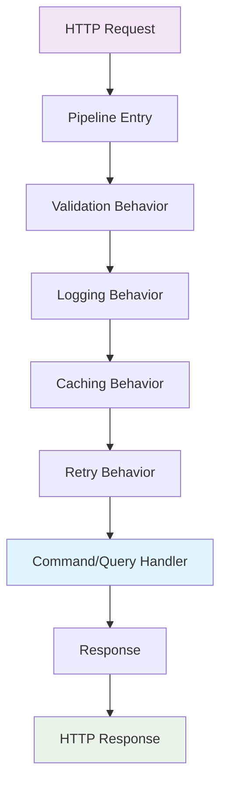

# CRISP: Command Response Interface Service Pattern

**CRISP** stands for **Command Response Interface Service Pattern** - a design pattern that brings clarity and structure to modern applications through procedural simplicity.

## What is CRISP?

CRISP is a pattern that combines:
- **Command Query Responsibility Segregation (CQRS)** - Separate reads from writes
- **Request/Response Pattern** - Clear input/output contracts  
- **Pipeline Processing** - Consistent cross-cutting concerns
- **Vertical Organization** - Features organized by capability, not by file type

## Core Principles

### 1. **Procedural Clarity**
Every request follows the same predictable path:
```
Request → Validate → Handle → Response
```

### 2. **Separation of Concerns** 
Commands change state, queries read state:

```csharp
// Commands (write operations)
public record CreateUserCommand(string Email, string Name) : ICommand<User>;
public record UpdateUserCommand(int Id, string Name) : ICommand<User>;
public record DeleteUserCommand(int Id) : ICommand;

// Queries (read operations)  
public record GetUserQuery(int Id) : IQuery<User>;
public record ListUsersQuery(int Page, int Size) : IQuery<PagedResult<User>>;
```

### 3. **Interface-Driven Design**
Clear contracts for every operation:

```csharp
// Handler interfaces
public interface ICommandHandler<TCommand, TResponse>
    where TCommand : ICommand<TResponse>
{
    Task<TResponse> Handle(TCommand command, CancellationToken cancellationToken);
}

public interface IQueryHandler<TQuery, TResponse>
    where TQuery : IQuery<TResponse>
{
    Task<TResponse> Handle(TQuery query, CancellationToken cancellationToken);
}
```

### 4. **Pipeline Processing**
Cross-cutting concerns handled consistently:

```csharp
Request → [Validation] → [Logging] → [Caching] → [Handler] → Response
```

## Vertical Layers: Feature-Based Organization

CRISP organizes code by **features**, not by file types. Each feature is a self-contained vertical slice:

```
Features/
├── Users/
│   ├── Commands/
│   │   ├── CreateUser.cs
│   │   └── UpdateUser.cs
│   ├── Queries/
│   │   ├── GetUser.cs
│   │   └── ListUsers.cs
│   └── Models/
│       └── User.cs
└── Orders/
    ├── Commands/
    │   ├── CreateOrder.cs
    │   └── ProcessOrder.cs
    └── Queries/
        ├── GetOrder.cs
        └── GetOrderHistory.cs
```

### Benefits of Vertical Organization:
- **Feature Cohesion**: Everything related to a feature is in one place
- **Team Independence**: Teams can work on different features without conflicts
- **Easier Testing**: Each feature can be tested in isolation
- **Clear Boundaries**: Feature boundaries are explicit and enforceable

## Real-World Example

Here's a complete feature in CRISP:

```csharp
// Command
public record CreateTodoCommand(
    [Required] string Title,
    string? Description
) : ICommand<TodoDto>;

// Handler
public class CreateTodoHandler : ICommandHandler<CreateTodoCommand, TodoDto>
{
    private readonly ITodoRepository _repository;
    
    public CreateTodoHandler(ITodoRepository repository) => _repository = repository;
    
    public async Task<TodoDto> Handle(CreateTodoCommand command, CancellationToken cancellationToken)
    {
        var todo = new Todo(command.Title, command.Description);
        await _repository.CreateAsync(todo);
        return new TodoDto(todo.Id, todo.Title, todo.Description, todo.IsCompleted);
    }
}

// Setup (Program.cs)
builder.Services.AddCrisp(crisp =>
{
    crisp.RegisterHandlersFromAssemblies(typeof(Program).Assembly);
});

app.MapCrisp(); // Auto-discovers and maps all endpoints
```

That's it! No controllers, no service interfaces, no repository abstractions (unless you want them).

## Built-in Pipeline Behaviors

CRISP includes production-ready pipeline behaviors:

### Validation
```csharp
public record CreateUserCommand(
    [Required] [Email] string Email,
    [Required] [StringLength(100)] string Name
) : ICommand<User>;
// Validation happens automatically!
```

### Logging & Metrics
```csharp
// Automatic structured logging with correlation IDs
// Performance metrics collection
// Error tracking and reporting
```

### Caching
```csharp
public record GetUserQuery(int Id) : IQuery<User>, ICacheable
{
    public string CacheKey => $"user:{Id}";
    public TimeSpan CacheDuration => TimeSpan.FromMinutes(5);
}
// Cached automatically!
```

### Retry & Circuit Breaker
```csharp
[Retry(maxAttempts: 3, exponentialBackoff: true)]
[CircuitBreaker(failureThreshold: 5, durationOfBreak: "00:01:00")]
public class ExternalApiHandler : IQueryHandler<GetExternalDataQuery, ExternalData>
{
    // Resilient by default!
}
```

## Why CRISP?

### ❌ Before (Traditional Architecture)
```csharp
[ApiController]
public class UserController : ControllerBase
{
    private readonly IUserService _userService;
    private readonly IMapper _mapper;
    private readonly IValidator<CreateUserRequest> _validator;
    private readonly ILogger<UserController> _logger;
    // 10+ constructor dependencies...
    
    [HttpPost]
    public async Task<ActionResult<UserDto>> CreateUser(CreateUserRequest request)
    {
        // Manual validation
        // Manual logging  
        // Manual error handling
        // Manual mapping
        // Business logic scattered
    }
}
```

### ✅ After (CRISP)
```csharp
public record CreateUserCommand(string Email, string Name) : ICommand<User>;

public class CreateUserHandler : ICommandHandler<CreateUserCommand, User>
{
    private readonly AppDbContext _db;
    
    public CreateUserHandler(AppDbContext db) => _db = db;
    
    public async Task<User> Handle(CreateUserCommand command, CancellationToken ct)
    {
        var user = new User(command.Email, command.Name);
        _db.Users.Add(user);
        await _db.SaveChangesAsync(ct);
        return user;
    }
}
// Validation, logging, error handling - all automatic!
```

## Framework Architecture



## Getting Started

1. **Install the package:**
   ```bash
   dotnet add package Crisp.AspNetCore
   ```

2. **Configure services:**
   ```csharp
   builder.Services.AddCrisp();
   ```

3. **Map endpoints:**
   ```csharp
   app.MapCrisp();
   ```

4. **Write your features:**
   ```csharp
   public record GetWeatherQuery(string City) : IQuery<WeatherForecast>;
   
   public class GetWeatherHandler : IQueryHandler<GetWeatherQuery, WeatherForecast>
   {
       public Task<WeatherForecast> Handle(GetWeatherQuery query, CancellationToken ct)
           => Task.FromResult(new WeatherForecast(query.City, "Sunny", 72));
   }
   ```

## Learn More

- [Getting Started Guide](getting-started.md) - Build your first CRISP app in 10 minutes
- [Migration from MediatR](migration-guide.md) - Moving from MediatR to CRISP
- [Core Concepts](concepts/) - Deep dive into CRISP principles
- [API Reference](api/) - Complete framework documentation

## Conclusion

CRISP isn't just another framework - it's a return to simplicity. By embracing procedural clarity and eliminating unnecessary abstractions, CRISP helps you build maintainable, testable, and scalable applications with less code and fewer headaches.

Ready to try it? Check out our [Getting Started Guide](getting-started.md) and build your first CRISP application in under 10 minutes!
