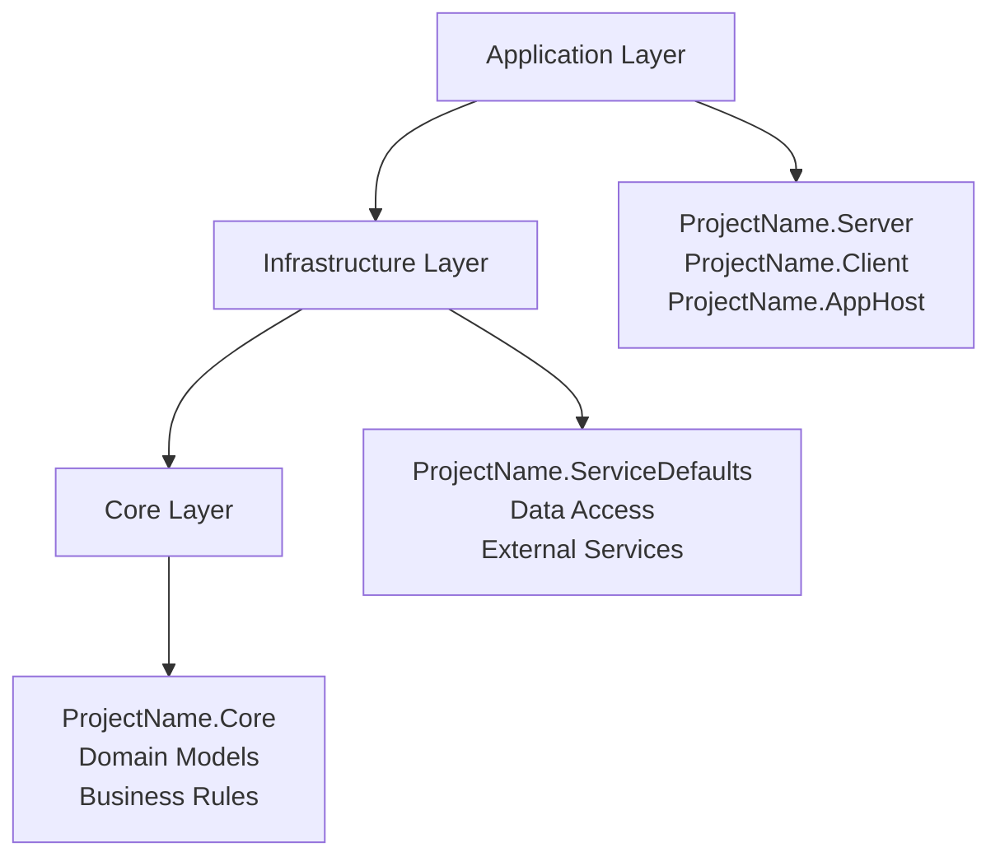

# AI Best Practices Guide for CRISP Architecture

## Overview

This guide provides comprehensive best practices for AI-assisted development using the CRISP (Command Response Interface Service Pattern) architecture. CRISP represents a modern approach to building scalable, maintainable applications that combines the benefits of CQRS with direct service contracts, making it ideal for AI-driven development workflows.

## Table of Contents

1. [Understanding CRISP Architecture](#understanding-crisp-architecture)
2. [AI Development Workflow](#ai-development-workflow)
3. [Layer-Specific Guidance](#layer-specific-guidance)
4. [Feature Development Patterns](#feature-development-patterns)
5. [Code Generation Guidelines](#code-generation-guidelines)
6. [Testing Strategy](#testing-strategy)
7. [Common Pitfalls and Solutions](#common-pitfalls-and-solutions)
8. [AI Tool Integration](#ai-tool-integration)

## Understanding CRISP Architecture

### Core Principles for AI Development

CRISP's architecture provides several advantages for AI-assisted development:

**1. Explicit Contracts** - Service interfaces are clear and discoverable
**2. Compile-time Safety** - Type-safe operations with full IDE support
**3. Predictable Patterns** - Consistent structure across all features
**4. Feature Isolation** - Vertical slices minimize cross-feature complexity

### Three-Layer Structure



## AI Development Workflow

### Phase 1: Requirements Analysis
When an AI is tasked with implementing features in CRISP:

1. **Identify the Domain**: Determine which business capability is being addressed
2. **Define Operations**: Specify commands (write) and queries (read) needed
3. **Understand Dependencies**: Map relationships to existing features
4. **Plan Vertical Slice**: Design the complete feature from UI to data

### Phase 2: Core Layer Design
Start with the domain contracts using FluentValidation:

```csharp
// 1. Define domain model
public record Product(
    Guid Id,
    string Name,
    decimal Price,
    string Category,
    bool IsActive
) : BaseAuditableModel;

// 2. Define commands with FluentValidation
public record CreateProduct : CreateCommand
{
    public string Name { get; set; } = string.Empty;
    public decimal Price { get; set; }
    public string Category { get; set; } = string.Empty;
    
    public Product ToProduct() => new(
        Id: Guid.NewGuid(),
        Name: Name,
        Price: Price,
        Category: Category,
        IsActive: true
    );
}

// 3. Define FluentValidation validator
public sealed class CreateProductValidator : BaseValidator<CreateProduct>
{
    public CreateProductValidator()
    {
        RuleFor(x => x.Name)
            .NotEmpty()
            .WithMessage("Product name is required")
            .MaximumLength(200)
            .WithMessage("Product name cannot exceed 200 characters");
            
        RuleFor(x => x.Price)
            .GreaterThan(0)
            .WithMessage("Price must be greater than zero");
            
        RuleFor(x => x.Category)
            .NotEmpty()
            .WithMessage("Category is required")
            .MaximumLength(100)
            .WithMessage("Category cannot exceed 100 characters");
    }
}

// 4. Define queries
public record GetProducts : PagedQuery<Product>
{
    public string? Category { get; init; }
    public decimal? MinPrice { get; init; }
    public decimal? MaxPrice { get; init; }
}
```

### Phase 3: Infrastructure Implementation
Implement service contracts:

```csharp
public class CreateProductService : ICreateService<CreateProduct>
{
    private readonly ApplicationDbContext _context;
    private readonly ILogger<CreateProductService> _logger;
    
    public CreateProductService(ApplicationDbContext context, ILogger<CreateProductService> logger)
    {
        _context = context;
        _logger = logger;
    }
    
    public async ValueTask<Guid> Send(CreateProduct command, CancellationToken cancellationToken = default)
    {
        _logger.LogInformation("Creating product: {Name}", command.Name);
        
        // Core validation
        var product = command.ToProduct();
        var validation = product.Validate();
        if (!validation.IsSuccess)
        {
            _logger.LogWarning("Product validation failed: {Errors}", string.Join(", ", validation.Errors));
            throw new ValidationException(validation.Errors);
        }
        
        // Application validation
        if (await _context.Products.AnyAsync(p => p.Name == command.Name, cancellationToken))
        {
            throw new ConflictException($"Product with name '{command.Name}' already exists");
        }
        
        // Create entity
        var entity = new ProductEntity
        {
            Id = product.Id,
            Name = product.Name,
            Price = product.Price,
            Category = product.Category,
            IsActive = product.IsActive
        };
        
        _context.Products.Add(entity);
        await _context.SaveChangesAsync(cancellationToken);
        
        _logger.LogInformation("Product created successfully: {ProductId}", entity.Id);
        return entity.Id;
    }
}
```

### Phase 4: Application Layer
Create co-located endpoints and services with middleware integration:

```csharp
// Single file: CreateProductEndpoint.cs
public sealed class CreateProductEndpoint : ICreateEndpoint<CreateProduct>
{
    public static RouteGroupBuilder MapEndpoint(RouteGroupBuilder app)
    {
        app.MapPost("", Handle)
            .WithName(nameof(CreateProduct))
            .Produces<Guid>(StatusCodes.Status201Created)
            .ProducesProblem(StatusCodes.Status400BadRequest)
            .ProducesProblem(StatusCodes.Status409Conflict)
            .RequireAuthorization(Permissions.CanCreateProduct)
            .AddEndpointFilter<ValidationEndpointFilter>(); // FluentValidation middleware
            
        return app;
    }
    
    public static async Task<IResult> Handle(
        CreateProduct command,
        ICreateService<CreateProduct> service,
        CancellationToken cancellationToken)
    {
        var productId = await service.Send(command, cancellationToken);
        return TypedResults.Created($"/api/products/{productId}", productId);
    }
}

// Service in same file
public sealed class CreateProductService : ICreateService<CreateProduct>
{
    private readonly ApplicationDbContext _context;
    private readonly ILogger<CreateProductService> _logger;
    
    public CreateProductService(ApplicationDbContext context, ILogger<CreateProductService> logger)
    {
        _context = context;
        _logger = logger;
    }
    
    public async ValueTask<Guid> Send(CreateProduct command, CancellationToken cancellationToken = default)
    {
        // FluentValidation handled by middleware, no need for manual validation
        _logger.LogInformation("Creating product: {Name}", command.Name);
        
        // Application-level validation (business rules)
        if (await _context.Products.AnyAsync(p => p.Name == command.Name, cancellationToken))
        {
            throw new ConflictException($"Product with name '{command.Name}' already exists");
        }
        
        var product = command.ToProduct();
        var entity = new ProductEntity
        {
            Id = product.Id,
            Name = product.Name,
            Price = product.Price,
            Category = product.Category,
            IsActive = product.IsActive
        };
        
        _context.Products.Add(entity);
        await _context.SaveChangesAsync(cancellationToken);
        
        _logger.LogInformation("Product created successfully: {ProductId}", entity.Id);
        return entity.Id;
    }
}
```

## Layer-Specific Guidance

### Core Layer (CRISP.Core) - AI Guidelines

**DO:**
- ✅ Generate immutable records for all domain models
- ✅ Use FluentValidation with BaseValidator<T> for all commands/queries
- ✅ Create clear command and query contracts
- ✅ Keep the layer dependency-free
- ✅ Use descriptive names following domain language
- ✅ Leverage Humanizer for user-friendly error messages

**DON'T:**
- ❌ Add infrastructure concerns (databases, external APIs)
- ❌ Use mutable classes for domain models
- ❌ Include UI-specific logic
- ❌ Reference other layers
- ❌ Use manual validation when FluentValidation is available

**FluentValidation Patterns:**
```csharp
public sealed class CreateUserValidator : BaseValidator<CreateUser>
{
    public CreateUserValidator()
    {
        RuleFor(x => x.Email)
            .NotEmpty()
            .WithMessage("Email is required")
            .EmailAddress()
            .WithMessage("Invalid email format");
            
        RuleFor(x => x.Name)
            .NotEmpty()
            .WithMessage("Name is required")
            .MaximumLength(100)
            .WithMessage("Name cannot exceed 100 characters");
    }
}
```

**AI Prompt Templates:**
```
"Create a domain model for [entity] with FluentValidation validator following CRISP patterns. 
Include [business rules] and use Humanizer for friendly error messages."

"Generate CRUD commands with FluentValidation validators for [entity] following CRISP conventions. 
Include pagination support for the get all query."
```

### Infrastructure Layer (CRISP.ServiceDefaults) - AI Guidelines

**DO:**
- ✅ Provide base Entity Framework entities and configurations
- ✅ Handle shared middleware (exception handling, validation, logging)
- ✅ Include common value objects and base entities
- ✅ Implement endpoint filters and cross-cutting concerns

**DON'T:**
- ❌ Put feature-specific entities here (they belong in features)
- ❌ Include business logic in base classes
- ❌ Create tight coupling between features
- ❌ Bypass the middleware pipeline

**Middleware Components:**
- **ExceptionHandler**: Global exception handling with proper HTTP status codes
- **ValidationEndpointFilter**: FluentValidation integration for automatic request validation
- **LoggingMiddleware**: Structured logging for requests and responses

**AI Prompt Templates:**
```
"Create base entity infrastructure for [domain concept] following CRISP ServiceDefaults patterns. 
Include ISoftDelete and IAuditableEntity interfaces where appropriate."

"Implement shared middleware for [cross-cutting concern] following CRISP patterns."
```

### Application Layer - AI Guidelines

**DO:**
- ✅ Organize by features (vertical slices)
  - ✅ Group related functionality together
  - ✅ Each feature is self-contained
  - ✅ Include feature-specific entities in feature folders
  - ✅ Co-locate endpoints and services in same file
- ✅ Use minimal API endpoints with typed results
- ✅ Implement proper authorization with permission-based security
- ✅ Add output caching where appropriate
- ✅ Handle errors gracefully through middleware

**Key Pattern - Endpoint/Service Co-location:**
```csharp
// Single file contains both endpoint and service
public sealed class CreateProductEndpoint : ICreateEndpoint<CreateProduct>
{
    public static RouteGroupBuilder MapEndpoint(RouteGroupBuilder app) { /* endpoint mapping */ }
    public static async Task<IResult> Handle(/* parameters */) { /* endpoint logic */ }
}

public sealed class CreateProductService : ICreateService<CreateProduct>
{
    public async ValueTask<Guid> Send(CreateProduct command, CancellationToken cancellationToken = default)
    {
        /* service implementation */
    }
}
```

**DON'T:**
- ❌ Put business logic in controllers/endpoints
- ❌ Create cross-feature dependencies
- ❌ Ignore security considerations
- ❌ Separate endpoints and services into different files

## Feature Development Patterns

### Complete Feature Generation Template

When AI generates a new feature, follow this structure:

```
1. Core Layer Components:
   ├── Domain Models (records)
   ├── Commands (create, update, delete) with FluentValidation
   ├── Queries (get single, get paged)
   ├── Events (domain events)
   └── Validators (FluentValidation BaseValidator<T>)

2. Application Layer - Feature Folder:
   ├── Entities/ (feature-specific EF entities)
   ├── ValueObjects/ (feature-specific value objects)
   ├── Endpoints/ (endpoint + service co-located files)
   │   ├── CreateProductEndpoint.cs (contains endpoint AND service)
   │   ├── GetProductsEndpoint.cs (contains endpoint AND service)
   │   └── UpdateProductEndpoint.cs (contains endpoint AND service)
   ├── Configurations/ (EF configurations)
   └── FeatureRegistration.cs

3. ServiceDefaults (Shared Only):
   ├── Base entities and interfaces
   ├── Middleware components
   ├── Common value objects
   └── Cross-cutting concerns
```

### Example: Complete Product Feature

**AI Prompt:**
```
"Generate a complete Product feature for CRISP architecture including:
- Product domain model with Name, Price, Category, Description
- CRUD operations with validation
- Pagination and filtering by category
- Entity Framework configuration
- API endpoints with proper security
- Blazor UI components for management"
```

### Feature Registration Pattern

```csharp
public class ProductFeature : IFeature
{
    public IServiceCollection AddFeature(IServiceCollection services)
    {
        // Register all product-related services
        services.AddScoped<ICreateService<CreateProduct>, CreateProductService>();
        services.AddScoped<IQueryService<GetProducts, PagedResponse<Product>>, GetProductsService>();
        services.AddScoped<IQueryService<GetProductById, Product>, GetProductByIdService>();
        services.AddScoped<IModifyService<UpdateProduct>, UpdateProductService>();
        services.AddScoped<IModifyService<DeleteCommand>, DeleteProductService>();
        
        return services;
    }
    
    public IEndpointRouteBuilder MapFeature(IEndpointRouteBuilder app)
    {
        var group = app.MapGroup("/api/products")
            .WithTags("Products")
            .RequireAuthorization();
            
        CreateProductEndpoint.MapEndpoint(group);
        GetProductsEndpoint.MapEndpoint(group);
        GetProductByIdEndpoint.MapEndpoint(group);
        UpdateProductEndpoint.MapEndpoint(group);
        DeleteProductEndpoint.MapEndpoint(group);
        
        return app;
    }
}
```

## Code Generation Guidelines

### Templates for AI Code Generation

#### 1. Domain Model Template
```csharp
public record {EntityName}(
    Guid Id,
    {PropertyDefinitions}
) : BaseAuditableModel
{
    public ValidationResult Validate()
    {
        var errors = new List<string>();
        
        {ValidationRules}
        
        return errors.Any() 
            ? ValidationResult.Failure(errors)
            : ValidationResult.Success();
    }
}
```

#### 2. Command Template
```csharp
public record {CommandName}(
    {Parameters}
) : {BaseCommandType}
{
    public {EntityName} To{EntityName}() => new(
        {PropertyMappings}
    );
}
```

#### 3. Service Template
```csharp
public class {ServiceName} : I{ServiceInterface}<{CommandOrQuery}>
{
    private readonly ApplicationDbContext _context;
    private readonly ILogger<{ServiceName}> _logger;
    
    public {ServiceName}(ApplicationDbContext context, ILogger<{ServiceName}> logger)
    {
        _context = context;
        _logger = logger;
    }
    
    public async ValueTask<{ReturnType}> Send({CommandOrQuery} {parameterName}, CancellationToken cancellationToken = default)
    {
        {ServiceImplementation}
    }
}
```

#### 4. Endpoint Template
```csharp
public sealed class {EndpointName} : I{EndpointInterface}<{CommandOrQuery}>
{
    public static RouteGroupBuilder MapEndpoint(RouteGroupBuilder app)
    {
        app.Map{HttpMethod}("{route}", Handle)
            .WithName(nameof({CommandOrQuery}))
            .Produces<{ReturnType}>(StatusCodes.Status{SuccessCode})
            .RequireAuthorization({Permissions});
            
        return app;
    }
    
    public static async Task<IResult> Handle(
        {Parameters},
        CancellationToken cancellationToken)
    {
        {HandlerImplementation}
    }
}
```

### AI Validation Checklist

When generating code, ensure:
- [ ] **Domain models are immutable records**
- [ ] **Validation is implemented in domain models**
- [ ] **Services use ValueTask return types**
- [ ] **Endpoints follow minimal API patterns**
- [ ] **Error handling is consistent**
- [ ] **Logging is properly implemented**
- [ ] **Authorization is configured**
- [ ] **Cancellation tokens are supported**

## Testing Strategy

### Unit Testing Patterns

```csharp
[TestClass]
public class CreateProductServiceTests
{
    private ApplicationDbContext _context;
    private ILogger<CreateProductService> _logger;
    private CreateProductService _service;
    
    [TestInitialize]
    public void Setup()
    {
        var options = new DbContextOptionsBuilder<ApplicationDbContext>()
            .UseInMemoryDatabase(databaseName: Guid.NewGuid().ToString())
            .Options;
            
        _context = new ApplicationDbContext(options);
        _logger = Mock.Of<ILogger<CreateProductService>>();
        _service = new CreateProductService(_context, _logger);
    }
    
    [TestMethod]
    public async Task Send_ValidCommand_CreatesProduct()
    {
        // Arrange
        var command = new CreateProduct("Test Product", 99.99m, "Electronics");
        
        // Act
        var result = await _service.Send(command);
        
        // Assert
        Assert.IsTrue(result != Guid.Empty);
        var product = await _context.Products.FindAsync(result);
        Assert.IsNotNull(product);
        Assert.AreEqual("Test Product", product.Name);
    }
    
    [TestMethod]
    public async Task Send_DuplicateName_ThrowsConflictException()
    {
        // Arrange
        _context.Products.Add(new ProductEntity { Name = "Existing Product" });
        await _context.SaveChangesAsync();
        
        var command = new CreateProduct("Existing Product", 99.99m, "Electronics");
        
        // Act & Assert
        await Assert.ThrowsExceptionAsync<ConflictException>(
            () => _service.Send(command).AsTask());
    }
}
```

### Integration Testing

```csharp
[TestClass]
public class ProductEndpointsTests : IClassFixture<WebApplicationFactory<Program>>
{
    private readonly WebApplicationFactory<Program> _factory;
    private readonly HttpClient _client;
    
    public ProductEndpointsTests(WebApplicationFactory<Program> factory)
    {
        _factory = factory;
        _client = _factory.CreateClient();
    }
    
    [TestMethod]
    public async Task CreateProduct_ValidRequest_ReturnsCreated()
    {
        // Arrange
        var command = new CreateProduct("Test Product", 99.99m, "Electronics");
        
        // Act
        var response = await _client.PostAsJsonAsync("/api/products", command);
        
        // Assert
        response.EnsureSuccessStatusCode();
        Assert.AreEqual(HttpStatusCode.Created, response.StatusCode);
    }
}
```

## Common Pitfalls and Solutions

### 1. Breaking Layer Boundaries

**❌ Wrong:**
```csharp
// Core layer referencing infrastructure
public record User
{
    public void SaveToDatabase(ApplicationDbContext context) // ❌ Infrastructure concern in Core
    {
        context.Users.Add(this);
    }
}
```

**✅ Correct:**
```csharp
// Core layer stays pure
public record User(Guid Id, string Email, string Name) : BaseAuditableModel
{
    public ValidationResult Validate() // ✅ Business logic only
    {
        // Validation logic
    }
}

// Infrastructure handles persistence
public class CreateUserService : ICreateService<CreateUser>
{
    public async ValueTask<Guid> Send(CreateUser command, CancellationToken cancellationToken = default)
    {
        // Handle persistence here
    }
}
```

### 2. Using Mediator Patterns

**❌ Wrong:**
```csharp
public class UserController : ControllerBase
{
    private readonly IMediator _mediator; // ❌ Avoid mediator

    public async Task<IActionResult> CreateUser(CreateUser command)
    {
        return await _mediator.Send(command);
    }
}
```

**✅ Correct:**
```csharp
public class UserController : ControllerBase
{
    private readonly ICreateService<CreateUser> _createUserService; // ✅ Direct service injection

    public async Task<IActionResult> CreateUser(CreateUser command)
    {
        var userId = await _createUserService.Send(command);
        return Created($"/api/users/{userId}", userId);
    }
}
```

### 3. Automatic Mapping

**❌ Wrong:**
```csharp
public class CreateUserService : ICreateService<CreateUser>
{
    public async ValueTask<Guid> Send(CreateUser command, CancellationToken cancellationToken = default)
    {
        var entity = _mapper.Map<ApplicationUser>(command); // ❌ Automatic mapping
        // ...
    }
}
```

**✅ Correct:**
```csharp
public class CreateUserService : ICreateService<CreateUser>
{
    public async ValueTask<Guid> Send(CreateUser command, CancellationToken cancellationToken = default)
    {
        // ✅ Manual mapping with explicit control
        var user = command.ToUser();
        var entity = new ApplicationUser
        {
            Id = user.Id,
            Email = user.Email,
            UserName = user.Email,
            Name = user.Name
        };
        // ...
    }
}
```

### 4. Mutable Domain Models

**❌ Wrong:**
```csharp
public class User : BaseModel // ❌ Mutable class
{
    public string Email { get; set; }
    public string Name { get; set; }
}
```

**✅ Correct:**
```csharp
public record User( // ✅ Immutable record
    Guid Id,
    string Email,
    string Name
) : BaseAuditableModel;
```

## CRISP Middleware Integration

### Built-in Middleware Components

CRISP provides several middleware components that AI should be aware of when generating code:

#### 1. ExceptionHandler
Provides global exception handling with proper HTTP status codes:

```csharp
// Automatically handles these exception types:
// - NotFoundException → 404 Not Found
// - ValidationException → 400 Bad Request  
// - ConflictException → 409 Conflict
// - UnauthorizedAccessException → 401 Unauthorized
// - General exceptions → 500 Internal Server Error

// Usage in services:
public async ValueTask<User> Send(GetUserById query, CancellationToken cancellationToken = default)
{
    var user = await _context.Users.FindAsync(query.Id, cancellationToken);
    if (user == null)
        throw new NotFoundException($"User with ID {query.Id} not found"); // Automatically becomes 404
        
    return user.ToContract();
}
```

#### 2. ValidationEndpointFilter
Automatically validates request objects using FluentValidation:

```csharp
// Add to endpoints for automatic validation
app.MapPost("", Handle)
    .AddEndpointFilter<ValidationEndpointFilter>(); // Validates command using registered validators

// No need for manual validation in services - middleware handles it
public async ValueTask<Guid> Send(CreateUser command, CancellationToken cancellationToken = default)
{
    // command is already validated by middleware
    // Focus on business logic only
}
```

#### 3. LoggingMiddleware
Provides structured logging for requests and responses.

### AI Middleware Guidelines

**DO:**
- ✅ Add `ValidationEndpointFilter` to all command endpoints
- ✅ Throw appropriate exceptions (they're handled by ExceptionHandler)
- ✅ Use structured logging in services
- ✅ Let middleware handle cross-cutting concerns

**DON'T:**
- ❌ Manually validate requests when ValidationEndpointFilter is available
- ❌ Handle exceptions manually (use middleware)
- ❌ Bypass the middleware pipeline
- ❌ Implement custom exception handling per endpoint

## AI Tool Integration

### GitHub Copilot Integration

Configure GitHub Copilot for CRISP-specific suggestions:

```json
// .vscode/settings.json
{
    "github.copilot.advanced": {
        "debug.overrideEngine": "copilot-chat",
        "inlineSuggest.enableProjectAwareInlineCompletions": true
    }
}
```

### Custom AI Prompts for CRISP

```
System: You are an expert .NET developer specializing in CRISP architecture. Always follow these principles:
1. Use immutable records for domain models in Core layer
2. Implement direct service injection (no mediator)
3. Keep layers properly separated
4. Use ValueTask for async operations
5. Include proper validation and error handling
6. Follow feature-based organization

When generating code, always consider:
- Which layer the code belongs to
- Proper dependency direction
- CQRS command/query separation
- Security and authorization requirements
```

### Code Analysis Integration

Add CRISP-specific analyzers to enforce architectural rules:

```xml
<!-- Directory.Build.props -->
<PropertyGroup>
    <EnableNETAnalyzers>true</EnableNETAnalyzers>
    <AnalysisLevel>latest</AnalysisLevel>
    <EnforceCodeStyleInBuild>true</EnforceCodeStyleInBuild>
</PropertyGroup>

<ItemGroup>
    <PackageReference Include="Microsoft.CodeAnalysis.Analyzers" Version="3.3.4" PrivateAssets="all" />
    <PackageReference Include="Microsoft.CodeAnalysis.CSharp" Version="4.8.0" PrivateAssets="all" />
</ItemGroup>
```

## Conclusion

CRISP architecture provides an excellent foundation for AI-assisted development by offering:

- **Predictable Patterns**: Consistent structure across all features
- **Clear Boundaries**: Well-defined layer responsibilities
- **Type Safety**: Compile-time verification of contracts
- **Performance**: Direct service calls without reflection overhead
- **Maintainability**: Feature-focused organization

By following these best practices, AI tools can effectively generate high-quality, maintainable code that adheres to CRISP architectural principles while providing excellent developer experience and application performance.

## Additional Resources

- [CRISP Architecture Overview](architecture-overview.md)
- [Core Layer Documentation](core-layer.md)
- [Feature Development Guide](feature-development-guide.md)
- [CQRS Service Contracts](cqrs-service-contracts.md)
- [Examples Directory](examples/)