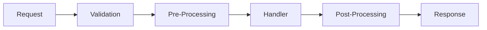

# The CRISP Pipeline

The pipeline is the heart of CRISP. Every request flows through the same predictable path.

## 🔄 The Flow



## 📦 What is a Pipeline Behavior?

A pipeline behavior wraps around your handler, letting you add functionality without touching business logic:

```csharp
public interface IPipelineBehavior<TRequest, TResponse>
{
    Task<TResponse> Handle(
        TRequest request, 
        RequestHandlerDelegate<TResponse> next,
        CancellationToken cancellationToken = default
    );
}
```

Think of it like middleware for your commands and queries!

## 🛠️ Common Pipeline Behaviors

### 1. Validation Behavior

```csharp
public class ValidationBehavior<TRequest, TResponse> : IPipelineBehavior<TRequest, TResponse>
{
    public async Task<TResponse> Handle(TRequest request, RequestHandlerDelegate<TResponse> next, CancellationToken cancellationToken)
    {
        // Validate using Data Annotations
        var validationContext = new ValidationContext(request);
        var validationResults = new List<ValidationResult>();
        
        if (!Validator.TryValidateObject(request, validationContext, validationResults, true))
        {
            var errors = validationResults.Select(vr => vr.ErrorMessage ?? "Validation error").ToArray();
            throw new ValidationException(errors);
        }
        
        // If valid, continue to next behavior/handler
        return await next();
    }
}
```

### 2. Logging Behavior

```csharp
public class LoggingBehavior<TRequest, TResponse> : IPipelineBehavior<TRequest, TResponse>
{
    private readonly ILogger<LoggingBehavior<TRequest, TResponse>> _logger;
    
    public async Task<TResponse> Handle(TRequest request, RequestHandlerDelegate<TResponse> next, CancellationToken cancellationToken)
    {
        var requestName = typeof(TRequest).Name;
        
        _logger.LogInformation("Handling {Request} at {Time}", 
            requestName, DateTime.UtcNow);
        
        var stopwatch = Stopwatch.StartNew();
        var response = await next();
        stopwatch.Stop();
        
        _logger.LogInformation("Handled {Request} in {ElapsedMs}ms", 
            requestName, stopwatch.ElapsedMilliseconds);
        
        return response;
    }
}
```

### 3. Retry Behavior (with Polly)

```csharp
public class RetryBehavior<TRequest, TResponse> : IPipelineBehavior<TRequest, TResponse>
    where TRequest : IRetryable
{
    public async Task<TResponse> Handle(TRequest request, RequestHandlerDelegate<TResponse> next, CancellationToken cancellationToken)
    {
        var retryPolicy = Policy
            .Handle<TransientException>()
            .WaitAndRetryAsync(
                3, 
                attempt => TimeSpan.FromSeconds(Math.Pow(2, attempt))
            );
        
        return await retryPolicy.ExecuteAsync(async () => await next());
    }
}
```

### 4. Transaction Behavior

```csharp
public class TransactionBehavior<TRequest, TResponse> : IPipelineBehavior<TRequest, TResponse>
    where TRequest : ITransactional
{
    private readonly IDbContext _context;
    
    public async Task<TResponse> Handle(TRequest request, RequestHandlerDelegate<TResponse> next, CancellationToken cancellationToken)
    {
        using var transaction = await _context.BeginTransactionAsync();
        try
        {
            var response = await next();
            await transaction.CommitAsync();
            return response;
        }
        catch
        {
            await transaction.RollbackAsync();
            throw;
        }
    }
}
```

## 🎯 Pipeline Ordering

Behaviors execute in the order they're registered:

```csharp
builder.Services.AddCrisp(options =>
{
    options.AddBehavior<LoggingBehavior<,>>();      // 1st
    options.AddBehavior<ValidationBehavior<,>>();   // 2nd
    options.AddBehavior<TransactionBehavior<,>>();  // 3rd
    options.AddBehavior<RetryBehavior<,>>();        // 4th
});
```

Flow: Logging → Validation → Transaction → Retry → **Handler** → Retry → Transaction → Validation → Logging

## 💡 Creating Custom Behaviors

Need caching? Rate limiting? Easy:

```csharp
public class CachingBehavior<TRequest, TResponse> : IPipelineBehavior<TRequest, TResponse>
    where TRequest : ICacheable
{
    private readonly IMemoryCache _cache;
      public async Task<TResponse> Handle(TRequest request, RequestHandlerDelegate<TResponse> next, CancellationToken cancellationToken)
    {
        var cacheKey = request.GetCacheKey();
        
        // Check cache first
        if (_cache.TryGetValue<TResponse>(cacheKey, out var cached))
            return cached;
        
        // Not in cache, execute handler
        var response = await next();
        
        // Cache the result
        _cache.Set(cacheKey, response, request.CacheDuration);
        
        return response;
    }
}

// Mark cacheable commands
public record GetUserQuery(int Id) : IQuery<User>, ICacheable
{
    public string GetCacheKey() => $"user-{Id}";
    public TimeSpan CacheDuration => TimeSpan.FromMinutes(5);
}
```

## 🔧 Conditional Behaviors

Only apply behaviors when needed:

```csharp
public interface IRetryable 
{
    int MaxRetries { get; }
}

// Only commands that implement IRetryable get retry logic
public record ProcessPaymentCommand(decimal Amount) : ICommand<PaymentResult>, IRetryable
{
    public int MaxRetries => 3;
}
```

## 📊 Pipeline Visualization

Enable pipeline visualization in development:

```csharp
if (app.Environment.IsDevelopment())
{
    app.MapCrispDiagnostics(); // Shows pipeline flow at /crisp/diagnostics
}
```

## 🎮 Real-World Example: Game Command

```csharp
public record AttackCommand(int PlayerId, int TargetId, int WeaponId) 
    : ICommand<AttackResult>, IValidatable, ITransactional, IAuditable
{
    // This command will automatically:
    // 1. Be validated
    // 2. Run in a transaction
    // 3. Be audited
    // 4. All without touching the handler!
}

public class AttackHandler : ICommandHandler<AttackCommand, AttackResult>
{
    public Task<AttackResult> Handle(AttackCommand command)
    {
        // Just game logic here, no infrastructure concerns!
        var damage = CalculateDamage(command.WeaponId);
        return Task.FromResult(new AttackResult(damage));
    }
}
```

## ✨ Benefits

1. **Separation of Concerns** - Business logic stays pure
2. **Reusability** - Write once, apply everywhere
3. **Testability** - Test behaviors independently
4. **Flexibility** - Add/remove behaviors without changing handlers
5. **Procedural Clarity** - Just a series of steps!

Next: [Commands and Queries](commands-queries.md) →