# CRISP Flow Diagrams

Visual guide to how requests flow through CRISP.

## 🔄 Basic Request Flow

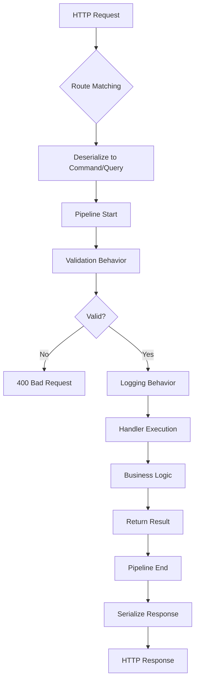

## 📊 Command Flow (Write Operation)

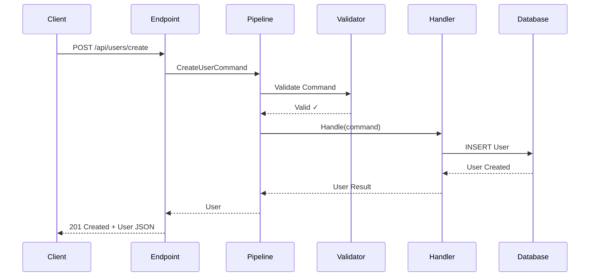

## 🔍 Query Flow (Read Operation)

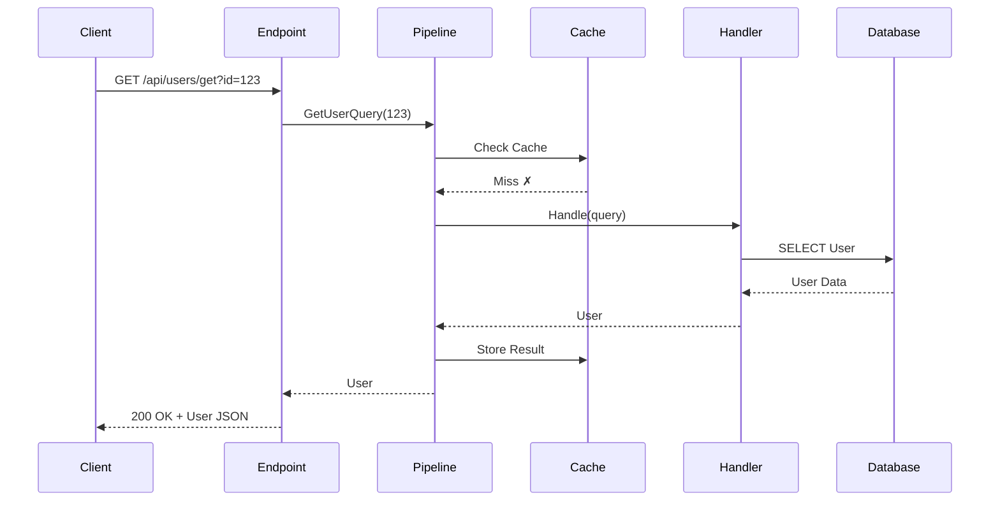

## 🛡️ Pipeline Behavior Chain

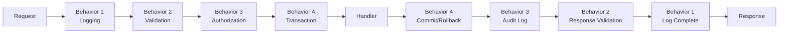

## 🔀 Conditional Flow (State Machine)

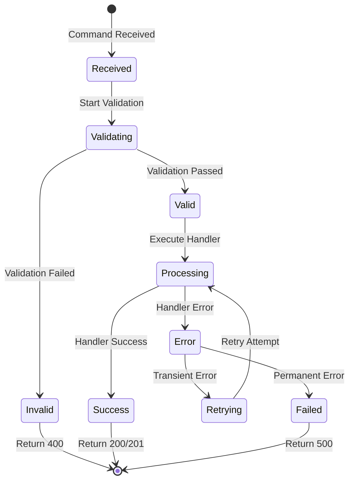

## 🎮 Game Command Flow

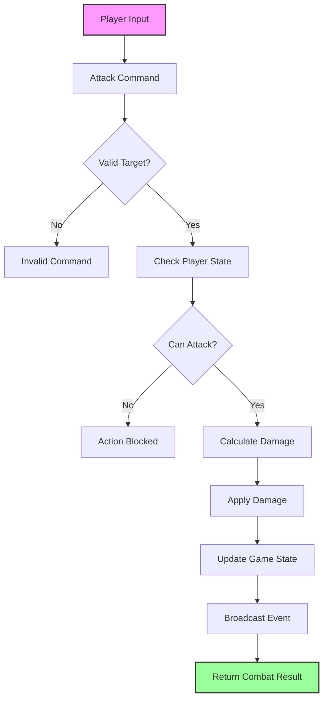

## 🔄 Error Handling Flow

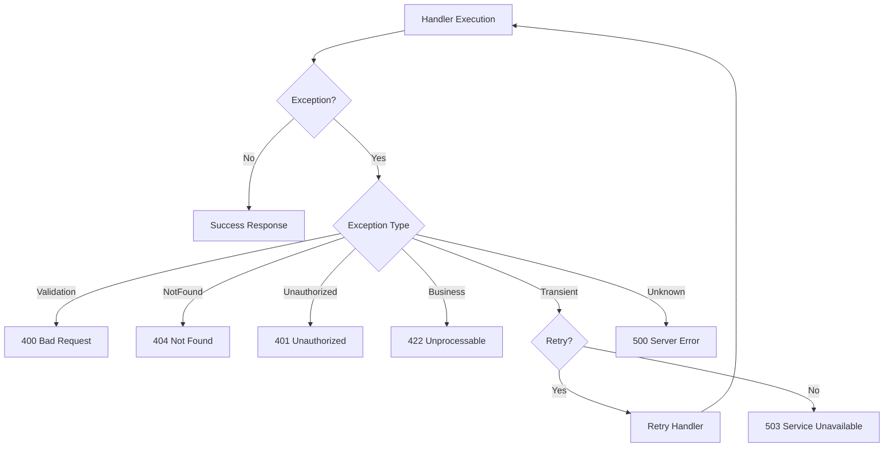

## 📦 Vertical Layer Communication

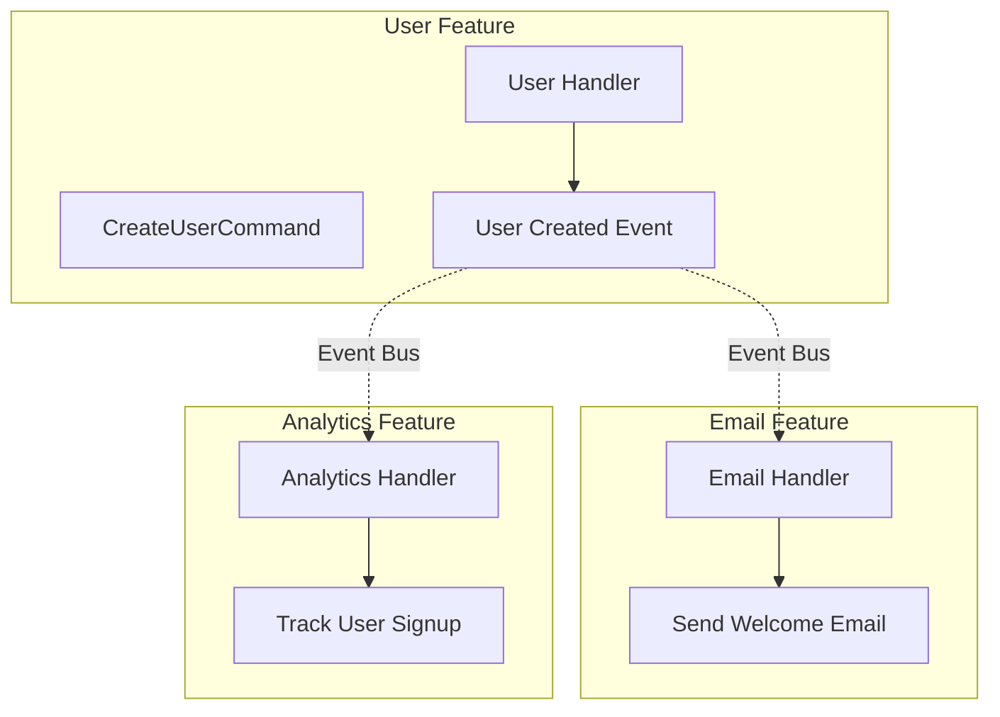

## 🚀 Performance Flow

```mermaid
gantt
    title Request Processing Timeline
    dateFormat X
    axisFormat %L ms
    
    section Client
    HTTP Request      :0, 10
    HTTP Response     :180, 20
    
    section Endpoint
    Route Matching    :10, 5
    Deserialization   :15, 10
    Serialization     :170, 10
    
    section Pipeline
    Validation        :25, 15
    Authorization     :40, 10
    Logging Start     :50, 5
    Logging End       :165, 5
    
    section Handler
    Business Logic    :55, 80
    Database Query    :75, 40
    
    section Cache
    Cache Check       :55, 5
    Cache Store       :135, 5
```

## 🔐 Authentication Flow

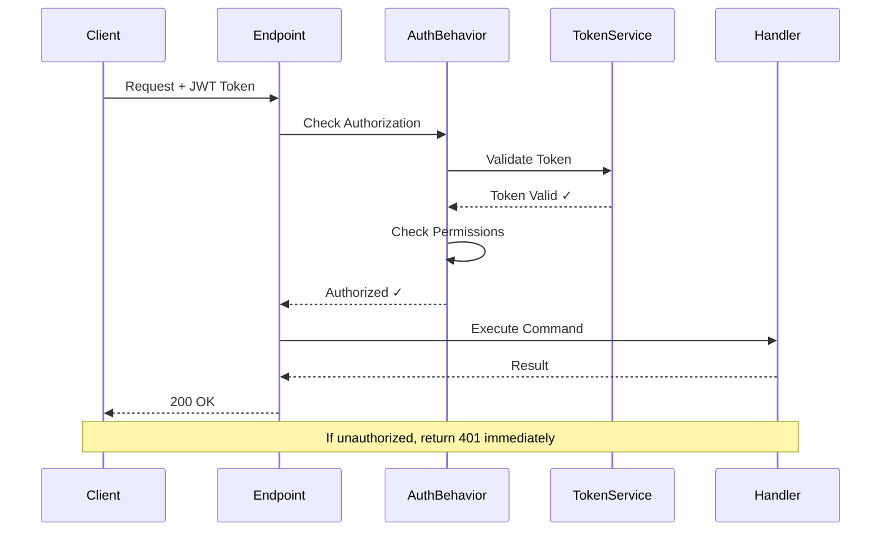

## 🔄 Batch Processing Flow

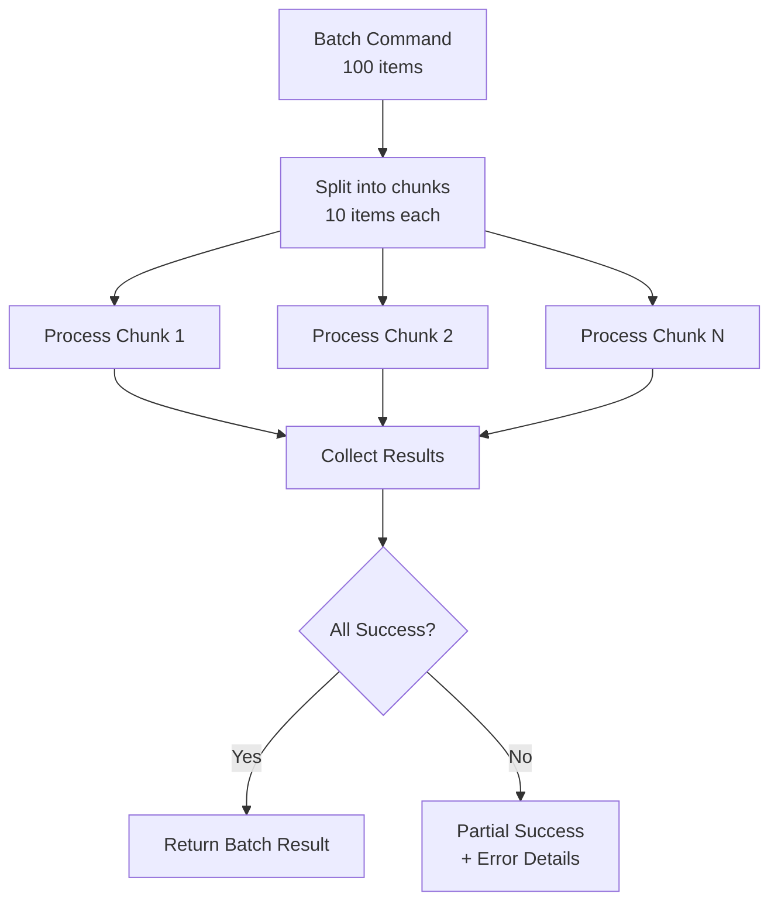

## 📊 Complete Request Lifecycle

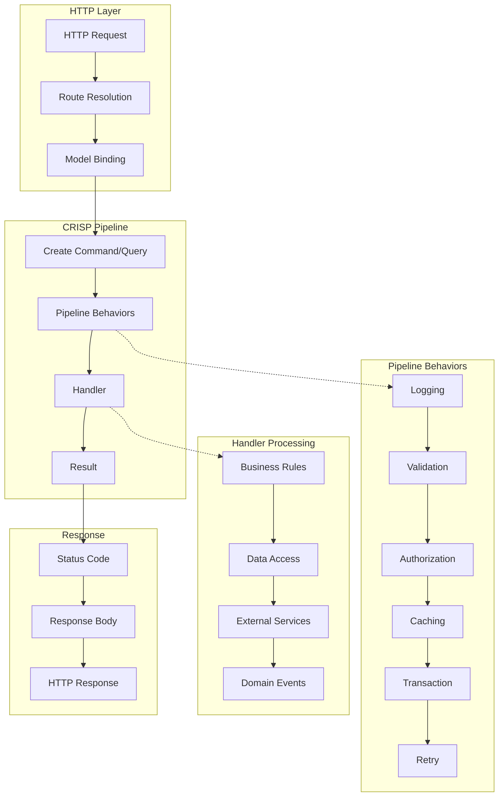

## 🎯 Key Insights

1. **Linear Flow** - Requests follow a predictable path
2. **Pipeline Control** - Behaviors wrap around handlers
3. **Early Exit** - Validation/auth failures stop processing
4. **Async Throughout** - Non-blocking at every step
5. **Event Driven** - Loose coupling between features

## 💡 Common Patterns

### Fast Path (Cached Query)
```
Request → Cache Hit → Response (< 5ms)
```

### Slow Path (Complex Command)
```
Request → Validation → Auth → Transaction → Handler → DB → Events → Response (50-200ms)
```

### Error Path
```
Request → Validation Fail → 400 Response (< 10ms)
```

This visual guide shows how CRISP maintains simplicity while handling complex scenarios through its pipeline architecture.